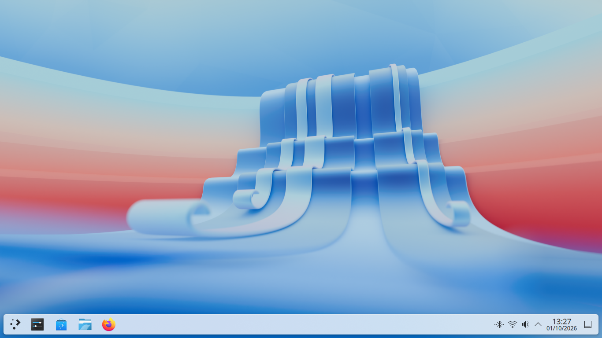
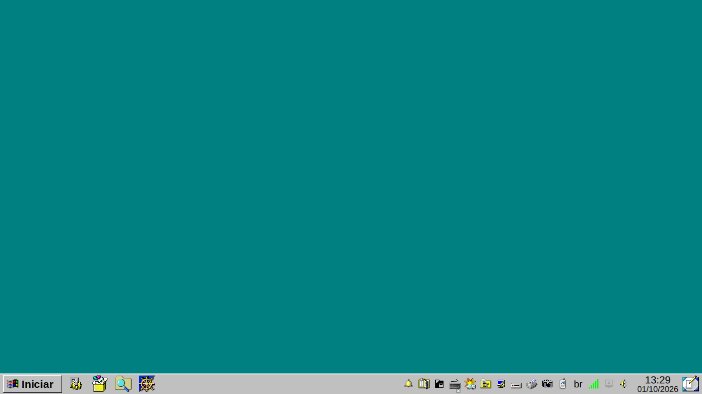
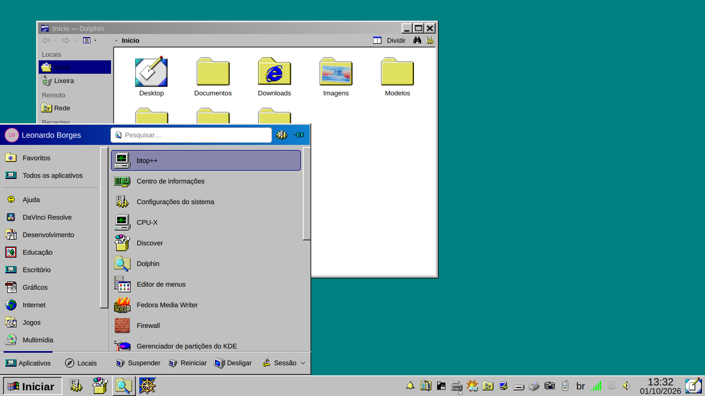
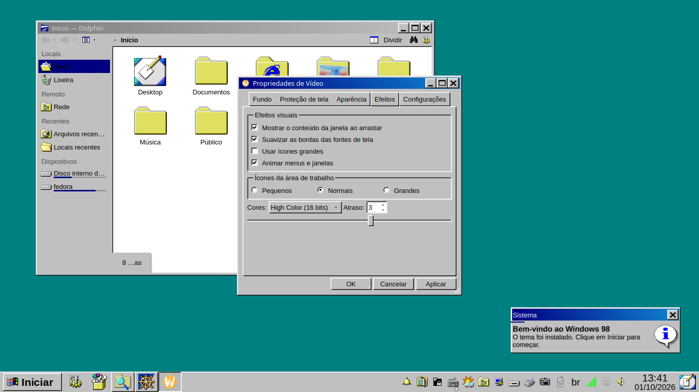
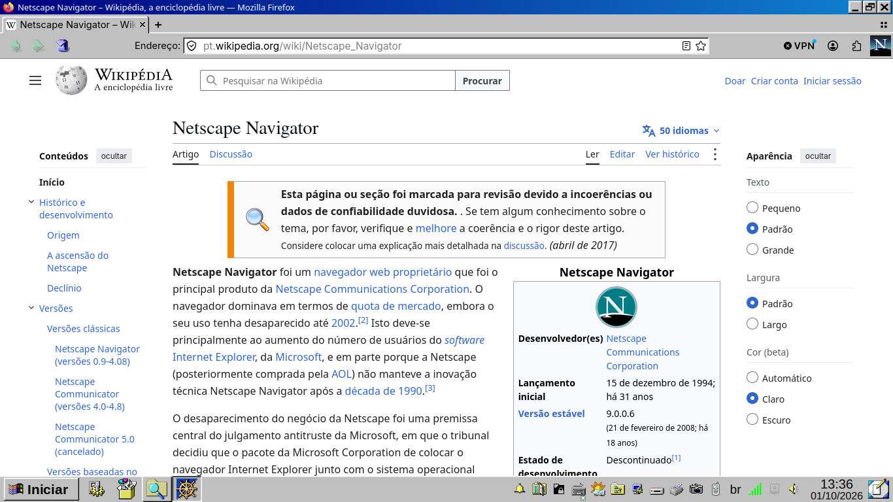

# win98-desktop

*[English version](README.en.md)*

Transforma o Linux num Windows 98: janelas, barra de tarefas, menu Iniciar, menus, ícones, cursor,
sons, popups e até o Firefox, que vira o Netscape.

Esta primeira versão é pro **KDE Plasma 6**. A ideia é adaptar depois pra outros ambientes
(Hyprland, GNOME…), ver [Planos](#planos).

Testado no **Fedora 44, KDE Plasma / KWin 6.7.5, Qt 6.11, Wayland**, com dois monitores. Nada é
fixo em pixel de tela: tudo acompanha o tamanho das janelas e dos monitores.

Feito por **Leonardo Borges** com a ajuda do **Claude** (Anthropic), em cima do trabalho de muita
gente: ícones do Chicago95 e do SE98, desenhos do Netscape do FOXSCAPEuC, medidas do 98.css e
outros. A lista completa, com links e licenças, está em **[CREDITOS.md](CREDITOS.md)**.

## Prints

| Antes (KDE Plasma 6 padrão) | Depois |
|---|---|
|  |  |

**Menu Iniciar** com os ícones do 98, por cima do Dolphin:



**Janelas, caixas de marcar, botões e notificação** (o Dolphin e uma janela de exemplo em Qt):



**Firefox como Netscape Communicator**:



Os prints foram tirados numa sessão do KDE separada e limpa, com o tema instalado pelo próprio
`instalar.sh`, numa tela de 1366×768.

## O que o tema muda

**Janelas**
- Barra de título azul-marinho em degradê com os botões [_][□][X] do 98 (Aurorae `Win98`,
  medidas exatas geradas por `gen_decoration.py`).
- Animações próprias (`kwin/win98windows`): ao abrir, a janela desenrola a partir da barra de
  título; ao fechar, enrola de volta; ao minimizar, voa encolhendo até o botão na barra de tarefas.
- Menus, submenus e popups deslizam a partir de onde abriram, como no 98, e fecham na hora
  (`kwin/win98menuslide`).

**Barra de tarefas e menu Iniciar**
- Painel cinza em relevo, 40px, grudado na borda; botões afundam quando a janela está ativa;
  setinha preta do 98 quando um app tem mais de uma janela.
- Botão "Iniciar" de verdade, que afunda ao clicar (cópia modificada do Kickoff 6.7.5 em
  `plasmoides/`), sem dica ao passar o mouse.
- Relógio com data; bandeja com todos os ícones à vista; controle de mídia com o botão do CD Player.

**Popups do Plasma** (notificações, bandeja, calendário…)
- "Janelinha" do 98: corpo cinza em relevo, cabeçalho azul com texto branco, X igual ao das janelas.
- Botões em relevo que afundam ao clicar, dica amarela com borda preta, barra de rolagem do 98,
  chaves liga/desliga desenhadas como caixa de marcar.

**Apps Qt/KDE** (Kvantum `Win98` + camada QML `qml/org/kde/win98`)
- Botões, campos, menus, abas e barras de rolagem em relevo 3D; caixas de marcar e rádios do 98.
- Listas com linha separando os itens, item escolhido azul-marinho e "afundado" ao passar o mouse.
- Chaves liga/desliga viram caixa de marcar.

**Ícones, cursor, fonte e sons**
- Ícones Chicago95 + SE98, com buracos tapados e apps modernos ganhando desenho 98 (Wine,
  utilitários do KDE, Discord, Chrome em pixel art); apps de marca como OBS ficam com o logo.
- Cursor Chicago95 branco; fonte Liberation Sans 10; título das janelas na fonte do 98 (MS W98 UI,
  baixada na instalação); sons novos no estilo 98.
- Fundo de tela verde-azulado (#008080), como o padrão do 98.

**Konsole = Prompt do MS-DOS** (`temas/konsole`)
- Janela de 80×25, texto cinza no preto com as 16 cores do console do 98, fonte do VGA da IBM
  (com acentos) e cursor sublinhado piscando. As opções do Konsole ficam numa barra com os ícones do
  98: nova aba, dividir exibição, copiar, colar, localizar, tamanho da fonte, tela cheia, propriedades
  e o menu. Sem barra de menu (Ctrl+Shift+M mostra).
- Prompt `C:\HOME\LEO>` e uma abertura no formato da do 98, com o sistema de verdade. Só nesse
  perfil: o `~/.bashrc` continua o mesmo. Comandos `cls`, `cd..` e `ver`.

**Firefox = Netscape Communicator** (`extras/firefox`)
- Barra de título do sistema, abas do 98, botões do Netscape (setas verdes, semáforo, casinha),
  "Endereço:", o "N" do Netscape girando enquanto carrega, menus do 98, lista de sugestões dos
  formulários do 98.
- Os sites continuam no modo escuro (`layout.css.prefers-color-scheme.content-override = 0` no
  `user.js`; apague essa linha se preferir sites claros).

## Instalar

Precisa do KDE Plasma 6 e de: `kvantum` (o pacote do Fedora já traz o plugin do Qt 6), `python3`
com `Pillow` e `PySide6`, `kiconfinder6`, `curl`. No Fedora:

```sh
sudo dnf install kvantum python3-pillow python3-pyside6 kf6-kiconthemes
git clone https://github.com/XxPregoxX/win98-desktop.git
cd win98-desktop
./instalar.sh
```

O `instalar.sh`:
1. confere se tem tudo o que precisa;
2. baixa o Chicago95 e o SE98 dos repositórios originais (`ferramentas/baixar_terceiros.sh`, uns
   40MB) e aplica os ajustes de ícones (`ferramentas/refazer_icones.sh`);
3. liga os arquivos desta pasta nos lugares onde o KDE procura (links simbólicos, lista em `.links`);
4. aplica as configurações (cores, estilo, ícones, cursor, fonte, decoração, efeitos, painel, fundo
   de tela, botão Iniciar) e reinicia o plasmashell;
5. instala o tema do Firefox nos perfis padrão (link `chrome` + preferências somadas ao `user.js`).

Antes de mexer, ele guarda o que estava no lugar dos links e as configurações do Plasma em
`backups/antes-da-instalacao-<data>/`. Cursor e fonte podem precisar de sair e entrar na sessão.
Não apague a pasta depois de instalar: o sistema usa os arquivos daqui.

`./instalar.sh --so-links` só recria os links, sem mexer em configuração.

## Desinstalar

```sh
./desinstalar.sh --simular   # mostra o que vai fazer
./desinstalar.sh
```

Volta pro Breeze (cores, estilo, ícones, cursor, decoração, efeitos), põe o Kickoff original no
lugar do botão Iniciar, tira os links e o tema do Firefox. Fundo de tela e altura do painel ficam
como estão. Também dá pra voltar pelas Configurações do Sistema (escolha Breeze em Cores, Estilo
do Plasma, Decoração, Estilo dos aplicativos, Ícones e Cursores).

## Como funciona

Os arquivos vivem **nesta pasta**. Os lugares onde o KDE procura (`~/.local/share/...`,
`~/.config/...`) são links simbólicos pra cá: editou aqui, vale no sistema. Quase tudo que é
desenho (SVG do Plasma, Kvantum, Aurorae, ícones gerados) sai de scripts em `ferramentas/`:
**edite o script, não o SVG**.

| Pasta | Conteúdo | Vira |
|---|---|---|
| `temas/color-schemes/` | Esquema de cores `Win98` | Cores do sistema |
| `temas/aurorae/Win98/` | Barra de título e botões | Decoração das janelas |
| `temas/kvantum/Win98/` | Relevo 3D dos widgets | Estilo dos apps Qt |
| `temas/plasma/Win98/` | Painel, barra de tarefas, popups, botões, dica, rolagem, chaves | Estilo do Plasma |
| `temas/icones/botao-iniciar/` | Imagens do botão Iniciar (normal e afundado) | Botão Iniciar |
| `temas/icones/chicago95-ajustes/` | Ícones finais e lista de ajustes do Chicago95 | Ícones |
| `temas/sons/Win98/` | Sons sintetizados (entrada, erro, ding…) | Sons |
| `kwin/win98menuslide/` | Efeito: menus deslizam como no 98 | Animação dos menus |
| `kwin/win98windows/` | Efeito: abrir/fechar/minimizar janelas | Animação das janelas |
| `plasmoides/org.kde.plasma.win98kickoff/` | Cópia modificada do Kickoff 6.7.5 | Menu Iniciar |
| `qml/org/kde/win98/` | Camada de estilo QML por cima do estilo do KDE | Listas e chaves em apps QML |
| `temas/konsole/` | Perfil, cores, prompt e barra do Prompt do MS-DOS | Konsole |
| `temas/fontes/` | Fonte PxPlus IBM VGA 8x16 | Fonte do Konsole |
| `extras/firefox/` | `user.js` e `chrome/` (userChrome + desenhos do Netscape) | Firefox |
| `extras/env/` | Variáveis da camada QML (carregadas no login) | — |
| `extras/kvantum/`, `extras/win98-startup.desktop` | Config do Kvantum, som de entrada | — |
| `terceiros/` | Pacotes de terceiros baixados na instalação (só os 2 ícones do Win95 +PLUS+ vêm junto) | Ícones, cursor |
| `ferramentas/` | Geradores, ajustes de ícones, download dos pacotes e testes | — |
| `docs/prints/` | Prints do README | — |
| `LICENSES/` | Textos das licenças | — |

## Ferramentas

Geradores (saída em `temas/`, `extras/` ou no Chicago95):
- `gen_decoration.py`, `gen_aurorae_buttons.py`: decoração Aurorae (`decoration.svg`) e os botões
  [_][□][X] da barra de título (22×20, símbolos do 98 redesenhados nesse tamanho, em pixel inteiro).
- `gen_start_button.py`: imagens do botão Iniciar (normal e afundado, 115×35).
- `gen_group_expander.py`: setinha de "várias janelas" na barra de tarefas.
- `gen_plasma_window.py`: janelinha dos popups (fundo, cabeçalho azul, rodapé, cores do cabeçalho).
- `gen_plasma_buttons.py`, `gen_plasma_tooltip.py`, `gen_plasma_scrollbar.py`,
  `gen_plasma_switch.py`: botões, dica amarela, barra de rolagem e chaves do Plasma.
- `gen_kvantum_checks.py`, `gen_kvantum_itemview.py`, `gen_kvantum_slider.py`, `gen_kvantum_tabs.py`:
  caixas de marcar/rádios, itens de lista, controle deslizante e abas (com o X de fechar) do Kvantum.
- `gen_titlebar_icons.py`: ícones window-close/minimize/maximize/restore = botões da barra de título.
- `gen_media_tray_icons.py`: play/pause/parado da bandeja = botão do CD Player.
- `gen_firefox_netscape.py`: recorta os desenhos do Netscape (FOXSCAPEuC) pro Firefox
  (precisa de `baixar_terceiros.sh --foxscape`).

Pacotes de terceiros e ajustes de ícones (mexem em `terceiros/Chicago95`):
- `baixar_terceiros.sh`: baixa Chicago95, SE98 e o cursor nas versões fixas (e o FOXSCAPEuC com
  `--foxscape`).
- `refazer_icones.sh`: roda todos os ajustes abaixo, na ordem.
- `fix_special_folders.py`, `fix_mime_icons.py`: pastas especiais e tipos de arquivo.
- `fix_action_icons.py`: ícones de botão que o KDE confundia com tipo de arquivo (`--auditar`).
- `fix_chrome_icon.py`, `fix_app_icons.py`: Chrome e apps que saíam modernos.
- `gen_folder_colors.py`: pastas coloridas (a pasta do Chicago95 em outras cores) e temáticas do SE98
  pro "Criar nova pasta" do Dolphin.
- `fix_chicago95_ajustes.py`: categorias do menu, links `-symbolic` e o resto dos ajustes à mão.
- `audit_mime_icons.py`: levantamento dos ícones de tipo de arquivo.

Testes: `test_decide.js` (direção do deslize dos menus, com `node`), `slide_test.py`,
`tb_test.py`, `kw_*.js`.

## Testar sem mexer no sistema

Truques usados no desenvolvimento, pra ver o resultado antes de aplicar:
- **Efeitos do KWin**: KWin aninhado invisível com DBus próprio (`dbus-run-session` +
  `kwin_wayland --virtual`, config temporária com `[Effect-<nome>] SlowFactor=40`) e `spectacle`
  tirando quadros. `readConfig` só lê chaves declaradas no `contents/config/main.xml` do efeito.
- **Firefox**: Firefox headless separado (perfil temporário, `--no-remote --marionette
  -remote-allow-system-access`) e foto da interface pelo Marionette em contexto chrome.
- **QML e Kvantum**: PySide6 offscreen (`QT_QPA_PLATFORM=offscreen`, `QT_QUICK_BACKEND=software`),
  mouse simulado com QTest.
- **Plasma**: depois de mudar SVG do tema, apagar `~/.cache/plasma_theme_Win98.kcache` e
  `~/.cache/ksvg-elements` e reiniciar com `kquitapp6 plasmashell; kstart plasmashell` (exportando
  as variáveis de `extras/env/win98-qml.sh` antes).
- **Instalador**: dá pra rodar o `instalar.sh` com `HOME` apontando pra uma pasta vazia e
  comandos falsos no `PATH` pros que falam com a sessão (`plasma-apply-*`, `gdbus`, `kquitapp6`,
  `kstart`), pra conferir links e configurações sem tocar no sistema.

## Limitações conhecidas

- Minimizar não é o "zoom da barra de título" do 98 (só a barra voando): efeito em JS do KWin não
  consegue mostrar só a barra longe do lugar da janela, então voa a janela inteira.
- Barra de rolagem do Plasma sem setinhas e com trilho só no hover (fixo no código do Plasma).
- Dica das miniaturas da barra de tarefas com a montagem do KDE (precisaria compilar uma cópia da
  barra de tarefas).
- Notificações do Chrome mostram o logo moderno: o Chrome manda o logo embutido nele como arquivo.
- Listas de apps Qt Widgets (Dolphin etc.) não têm a linha entre itens (o Kvantum não desenha).

## Coisas a saber

- **Botão Iniciar (cópia do Kickoff)**: se uma atualização do Plasma quebrar o menu Iniciar, rode
  `./desinstalar.sh` ou volte só o menu: com o plasmashell parado (`kquitapp6 plasmashell`), troque
  `plugin=org.kde.plasma.win98kickoff` por `org.kde.plasma.kickoff` no
  `~/.config/plasma-org.kde.plasma.desktop-appletsrc` e rode `kstart plasmashell`. Pra atualizar a
  cópia, baixe os arquivos da nova versão em `invent.kde.org/plasma/plasma-desktop`
  (`applets/kickoff`) e reaplique as mudanças marcadas com `Win98` no `main.qml`, a conversão
  `i18n` → `i18nd("plasma_applet_org.kde.plasma.kickoff", ...)` e o `qmldir`.
- **Camada de estilo QML** (`qml/org/kde/win98`): ligada pelas variáveis em `extras/env/win98-qml.sh`,
  que o Plasma carrega no login. Se algum app em QML parar de abrir depois de uma atualização do
  KDE, apague `~/.config/plasma-workspace/env/win98-qml.sh` e saia e entre na sessão.
- **Controle de mídia da bandeja**: se o plasmashell reiniciar com música tocando, ele só volta a
  aparecer depois de pausar e dar play (comportamento do Plasma).
- **Firefox**: o instalador troca uma pasta `chrome` que já exista no perfil pelo tema (a sua vai
  pro backup). Precisa reiniciar o Firefox pra ver.

## Planos

- **Modo escuro**: um "98 escuro", com o mesmo relevo e cores escuras, e um jeito fácil de alternar.
- **Outros ambientes**: Hyprland primeiro, talvez GNOME. Quase tudo aqui é do KDE (Plasma, KWin,
  Kvantum, Aurorae), mas dá pra reaproveitar os ícones (são tema freedesktop), o cursor, os sons, o
  tema do Firefox inteiro, as cores e medidas do 98.css usadas nos geradores, e o Kvantum pros apps
  Qt (funciona fora do KDE com `QT_STYLE_OVERRIDE=kvantum`).

## Créditos e licença

Tudo o que veio de outras pessoas, com autor, link e licença: **[CREDITOS.md](CREDITOS.md)**.
Em resumo: ícones do **Chicago95** (grassmunk e colaboradores) e do **SE98** (nestoris), dois ícones
do **Windows 95 +PLUS+** (aconfuseddragon), desenhos do Netscape do **FOXSCAPEuC** (Michael Walden),
medidas e relevo do **98.css** (Jordan Scales), o **Kickoff**, efeitos do **KWin** e o
**qqc2-desktop-style** da comunidade KDE, e as ferramentas que tornaram isso possível (Kvantum, Qt,
PySide6, Pillow, ImageMagick, SoX…).

Projeto de **Leonardo Borges** ([XxPregoxX](https://github.com/XxPregoxX)), feito com a ajuda do
**Claude** ([Anthropic](https://www.anthropic.com)), pelo [Claude Code](https://claude.com/claude-code).

Licença: **GPL-3.0-or-later** ([`LICENSE`](LICENSE)), exceto as partes de terceiros, que mantêm a
licença original (tabela em [CREDITOS.md](CREDITOS.md#licença-do-projeto)). Atenção: os desenhos
do Netscape (`extras/firefox/chrome/netscape/`) são CC BY-NC-SA 3.0, **sem uso comercial**.

Projeto de fã, sem ligação com a Microsoft, a Netscape ou qualquer outra empresa. Windows é marca
da Microsoft.
